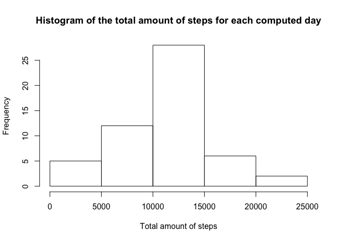
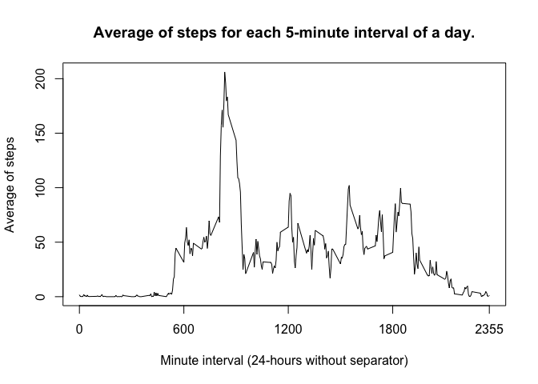
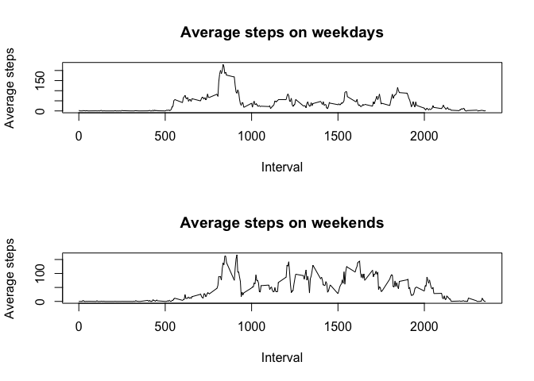

# Reproducible Research: Peer Assessment 1

&nbsp;
&nbsp;

## Loading and preprocessing the data

The code shown below will load the file _activity.csv_, if present, and store it in an 
R's dataframe object.


```r
if (!file.exists("activity.csv")) {
    stop("The 'activity.csv' file wasn't found in the current working directory.")
}
activity.data <- read.csv("activity.csv")
```

Now the dataframe object is stored in the _activity.data_ variable. It's structure can be
seen using the _head_ and _tail_ functions.


```r
head(activity.data)
```

```
##   steps       date interval
## 1    NA 2012-10-01        0
## 2    NA 2012-10-01        5
## 3    NA 2012-10-01       10
## 4    NA 2012-10-01       15
## 5    NA 2012-10-01       20
## 6    NA 2012-10-01       25
```

```r
tail(activity.data)
```

```
##       steps       date interval
## 17563    NA 2012-11-30     2330
## 17564    NA 2012-11-30     2335
## 17565    NA 2012-11-30     2340
## 17566    NA 2012-11-30     2345
## 17567    NA 2012-11-30     2350
## 17568    NA 2012-11-30     2355
```

&nbsp;
&nbsp;

## What is mean total number of steps taken per day?

The _split_ function will group the _steps_ observations by their _date_ values.


```r
steps.by.day <- split(activity.data$steps, activity.data$date)
```

The _steps.by.day_ variable stores a list of vectors named after their _date_ value which 
contains all the _steps_ for the given _date_. An example of an entry on this is list is shown below.


```r
steps.by.day[1]
```

```
## $`2012-10-01`
##   [1] NA NA NA NA NA NA NA NA NA NA NA NA NA NA NA NA NA NA NA NA NA NA NA
##  [24] NA NA NA NA NA NA NA NA NA NA NA NA NA NA NA NA NA NA NA NA NA NA NA
##  [47] NA NA NA NA NA NA NA NA NA NA NA NA NA NA NA NA NA NA NA NA NA NA NA
##  [70] NA NA NA NA NA NA NA NA NA NA NA NA NA NA NA NA NA NA NA NA NA NA NA
##  [93] NA NA NA NA NA NA NA NA NA NA NA NA NA NA NA NA NA NA NA NA NA NA NA
## [116] NA NA NA NA NA NA NA NA NA NA NA NA NA NA NA NA NA NA NA NA NA NA NA
## [139] NA NA NA NA NA NA NA NA NA NA NA NA NA NA NA NA NA NA NA NA NA NA NA
## [162] NA NA NA NA NA NA NA NA NA NA NA NA NA NA NA NA NA NA NA NA NA NA NA
## [185] NA NA NA NA NA NA NA NA NA NA NA NA NA NA NA NA NA NA NA NA NA NA NA
## [208] NA NA NA NA NA NA NA NA NA NA NA NA NA NA NA NA NA NA NA NA NA NA NA
## [231] NA NA NA NA NA NA NA NA NA NA NA NA NA NA NA NA NA NA NA NA NA NA NA
## [254] NA NA NA NA NA NA NA NA NA NA NA NA NA NA NA NA NA NA NA NA NA NA NA
## [277] NA NA NA NA NA NA NA NA NA NA NA NA
```

The _Filter_ function will perform a check on each entry in this list based on a custom
function and return each element for which the evaluation was true.


```r
steps.by.day <- Filter(function(x) all(!is.na(x)), steps.by.day)
```

The _steps.by.day_ variable now contains a list of vectors for which at least a non-_NA_
value was found.


```r
steps.by.day[1]
```

```
## $`2012-10-02`
##   [1]   0   0   0   0   0   0   0   0   0   0   0   0   0   0   0   0   0
##  [18]   0   0   0   0   0   0   0   0   0   0   0   0   0   0   0   0   0
##  [35]   0   0   0   0   0   0   0   0   0   0   0   0   0   0   0   0   0
##  [52]   0   0   0   0   0   0   0   0   0   0   0   0   0   0   0   0   0
##  [69]   0   0   0   0   0   0   0   0   0   0   0   0   0   0   0   0   0
##  [86]   0   0   0   0   0   0   0   0   0   0   0   0   0   0   0   0   0
## [103]   0   0   0   0   0   0   0   0   0   0   0   0   0   0   0   0   0
## [120]   0   0   0   0   0   0   0   0   0   0   0   0   0   0   0   0   0
## [137]   0   0   0   0   0   0   0   0   0   0   0   0   0   0   0   0   0
## [154]   0   0   0   0   0   0   0   0   0   0   0   0   0   0   0   0   0
## [171]   0   0   0   0   0   0   0   0   0   0   0   0   0   0   0   0   0
## [188]   0   0   0   0   0   0   0   0   0   0   0   0   0   0   0   0   0
## [205]   0   0   0   0   0   0   0   0   0   0   0   0   0   0   0   0   0
## [222]   0   0   0   0   0   0   0   0   0   0   0   0   0   0   0   0   0
## [239]   0   0   0   0   0   0   0   0   0   0   0   0   0   0   0   0   0
## [256]   0   0   0   0   0   0   0   0   0   0   0 117   9   0   0   0   0
## [273]   0   0   0   0   0   0   0   0   0   0   0   0   0   0   0   0
```

Finally, the _sum_ function will give the total amount of steps for each day.

```r
steps.by.day <- sapply(steps.by.day, sum)
steps.by.day
```

```
## 2012-10-02 2012-10-03 2012-10-04 2012-10-05 2012-10-06 2012-10-07 
##        126      11352      12116      13294      15420      11015 
## 2012-10-09 2012-10-10 2012-10-11 2012-10-12 2012-10-13 2012-10-14 
##      12811       9900      10304      17382      12426      15098 
## 2012-10-15 2012-10-16 2012-10-17 2012-10-18 2012-10-19 2012-10-20 
##      10139      15084      13452      10056      11829      10395 
## 2012-10-21 2012-10-22 2012-10-23 2012-10-24 2012-10-25 2012-10-26 
##       8821      13460       8918       8355       2492       6778 
## 2012-10-27 2012-10-28 2012-10-29 2012-10-30 2012-10-31 2012-11-02 
##      10119      11458       5018       9819      15414      10600 
## 2012-11-03 2012-11-05 2012-11-06 2012-11-07 2012-11-08 2012-11-11 
##      10571      10439       8334      12883       3219      12608 
## 2012-11-12 2012-11-13 2012-11-15 2012-11-16 2012-11-17 2012-11-18 
##      10765       7336         41       5441      14339      15110 
## 2012-11-19 2012-11-20 2012-11-21 2012-11-22 2012-11-23 2012-11-24 
##       8841       4472      12787      20427      21194      14478 
## 2012-11-25 2012-11-26 2012-11-27 2012-11-28 2012-11-29 
##      11834      11162      13646      10183       7047
```

As the result of _sapply_ it's a named vector, it can be directly passed to the _hist_
and _summary_ function to show how it's distribution is shaped, and which are the mean
and median values.


```r
hist(steps.by.day, main = "Histogram of the total amount of steps for each computed day",
     xlab = "Total amount of steps")
```

 

```r
summary(steps.by.day)
```

```
##    Min. 1st Qu.  Median    Mean 3rd Qu.    Max. 
##      41    8841   10760   10770   13290   21190
```

The total amount of steps per day follow a normal distribution, with a median of 1760 and
a mean of 1770.

&nbsp;
&nbsp;

## What is the average daily activity pattern?

The same split-based approach can be taken to get the average number of steps for each 
5-minutes interval.


```r
steps.by.interval <- sapply(split(activity.data$steps, activity.data$interval), 
                            mean, na.rm = T)
plot(names(steps.by.interval), steps.by.interval,
     type = "l", main = "Average of steps for each 5-minute interval of a day.",
     xlab = "Minute interval (24-hours without separator)",
     ylab = "Average of steps",
     xaxt = "n")
axis(1, at = c(0, 600, 1200, 1800, 2355))
```

 

The following code will compute the 5-minute interval with the highest average of steps
and will add the ':' separator in 24-hours clocktime.

```r
highest.average <- names(steps.by.interval[steps.by.interval == max(steps.by.interval)])
cat(substring(as.character(highest.average), 
                           first = 1, last = nchar(highest.average) - 2),
    ":",
    substring(as.character(highest.average),
                           first = nchar(highest.average) - 1), sep = "")
```

```
## 8:35
```

As the intervals are indexed by the starting time, the interval from 8:35 to 8:40 has the
highest average of steps across all computed dates.

&nbsp;
&nbsp;

## Imputing missing values

The previously shown functions _all_ and _is.na_ can tell which columns contain missing
values.

```r
sapply(activity.data, function (x) all(!is.na(x)))
```

```
##    steps     date interval 
##    FALSE     TRUE     TRUE
```

Once identified, the amount of missing values can be computed using the _sum_ function.


```r
sum(is.na(activity.data$steps))
```

```
## [1] 2304
```

```r
mean(activity.data$steps, na.rm = T)
```

```
## [1] 37.3826
```

To fill the intervals with missing values, the following code will use the historical
average for that same interval on the dates for which observations are available. Recall
that this information was already computed in the previous stage and stored in the 
_steps.by.interval_ named vector. Also, the vector can be recycled, as the data for the
whole day is missing, and each day has 288 5-minute intervals, as it's the length of the
_steps.by.interval_ variable.


```r
activity.data$steps[which(is.na(activity.data$steps))] <- steps.by.interval
sum(is.na(activity.data$steps))
```

```
## [1] 0
```

```r
mean(activity.data$steps)
```

```
## [1] 37.3826
```

```r
mean(steps.by.interval)
```

```
## [1] 37.3826
```

As shown, filling the missing values with the average for the corresponding interval
didn't affect the mean at all.

&nbsp;
&nbsp;

## Are there differences in activity patterns between weekdays and weekends?

The _weekday_ function returns the day of the week that corresponds to the given input
date. The _ifelse_ function will fill a new column, named _weekday_, in the _activity.data_
dataframe, to separate days of the week from those from the weekend.


```r
activity.data$day <- weekdays(as.Date(activity.data$date))
activity.data$weekday <- ifelse(activity.data$day %in% c("Saturday", "Sunday"), 
                                 "Weekend", 
                                 "Weekday")
head(activity.data[activity.data$day == "Sunday",])
```

```
##      steps       date interval    day weekday
## 1729     0 2012-10-07        0 Sunday Weekend
## 1730     0 2012-10-07        5 Sunday Weekend
## 1731     0 2012-10-07       10 Sunday Weekend
## 1732     0 2012-10-07       15 Sunday Weekend
## 1733     0 2012-10-07       20 Sunday Weekend
## 1734     0 2012-10-07       25 Sunday Weekend
```

```r
head(activity.data[activity.data$day == "Monday",])
```

```
##       steps       date interval    day weekday
## 1 1.7169811 2012-10-01        0 Monday Weekday
## 2 0.3396226 2012-10-01        5 Monday Weekday
## 3 0.1320755 2012-10-01       10 Monday Weekday
## 4 0.1509434 2012-10-01       15 Monday Weekday
## 5 0.0754717 2012-10-01       20 Monday Weekday
## 6 2.0943396 2012-10-01       25 Monday Weekday
```

Now, the mean can be computed for both all weekend and all weekdays.


```r
weekday.means <- sapply(split(activity.data$steps[activity.data$weekday == "Weekday"],
                              activity.data$interval[activity.data$weekday == "Weekday"]),
                        mean, na.rm = T)
weekend.means <- sapply(split(activity.data$steps[activity.data$weekday == "Weekend"],
                              activity.data$interval[activity.data$weekday == "Weekend"]),
                        mean, na.rm = T)
par(mfrow = c(2, 1))
plot(names(weekday.means), weekday.means, type = "l",
     xlab = "Interval", ylab = "Average steps", main = "Average steps on weekdays")
plot(names(weekend.means), weekend.means, type = "l",
     xlab = "Interval", ylab = "Average steps", main = "Average steps on weekends")
```

 
